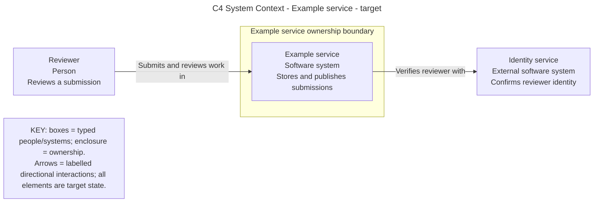
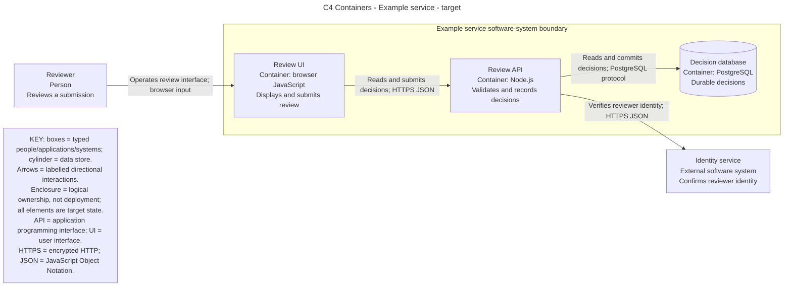

# Adaptable templates

Use only the templates useful to the requested views.
The examples share a synthetic target model and use Mermaid; replace their domain labels and evidence rather than copying them as facts.
Validate adapted sources with the installed parser or renderer before delivery.

## Model and view records

```text
Element: id | name | C4 type | parent | responsibility | technology | owner/trust | state | evidence
Relationship: from | to | directional action | protocol | state | evidence
View: id | diagram type | scope | audience | revision/environment | question answered | limitations
```

## System context skeleton



## Container skeleton



## Component view adaptation

Expand only `Review API` from the container skeleton.
Example components: `Request adapter [Component: Node.js]`, `Decision service [Component: TypeScript]`, and `Decision repository [Component: TypeScript / SQL]`.
Keep `Review UI` and `Decision database` as supporting containers, and `Identity service` as an external system, outside that API boundary.
Label internal calls as function calls and the repository-to-database relationship as PostgreSQL protocol.
The request adapter verifies reviewer identity with `Identity service` over HTTPS JSON.
Do not expand the database into tables in the same view.

## Deployment record template

```text
Environment: name and current/target status
Node: execution environment/host/network
Instance: model container ID + pinned revision/config reference
Connection: source instance -> destination instance, protocol and private/public boundary
Key: node nesting, instances, infrastructure nodes and line meanings
Evidence: observed runtime receipt or explicit proposed topology
```

## Dynamic record template

```text
Scenario: concrete user action and result
Level: system OR container OR component scope
Participants: existing static-model IDs
Sequence: numbered caller -> receiver: action [protocol]
Atomic region: named transaction/lock owner
Failure/retry: observable refusal, idempotency or recovery behavior
Key: boundary boxes, call/reply arrows, ordering and state
Evidence: source path/revision or runtime receipt
```
