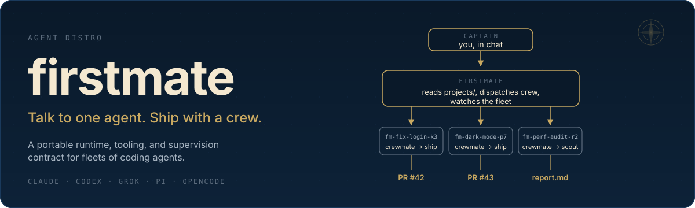
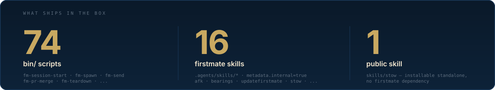
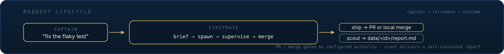

<p align="center">
  
</p>

<p align="center">
  <a href="https://img.shields.io/badge/platform-macOS%20%7C%20Linux-blue?style=flat-square"></a>
  <a href="https://x.com/kunchenguid"></a>
  <a href="https://discord.gg/Wsy2NpnZDu"></a>
</p>

## What it is

You can run one coding agent easily. The moment you want three project tasks done in parallel — fixes, investigations, plans, audits — you become a tab-juggler: babysitting sessions, copy-pasting context between repos, forgetting which terminal had the failing test.

firstmate flips the model. You talk to a single agent — the first mate — and it runs the crew for you: spawning autonomous agents in a visible session backend, giving each a clean git worktree, supervising them to completion, and handing you finished PRs, approved local merges, or standalone investigation reports. For larger fleets, you can opt in to persistent **secondmates** — domain supervisors that are still ordinary direct reports, but run from their own isolated firstmate homes.

firstmate is not a model, not a harness, not a skill, not an MCP server, and not a CLI.
firstmate is an **agent distro** for running a crew of agents.
An agent distro is a portable directory of instructions, skills, tooling, policies, and state conventions that turns a general-purpose agent into a specialized one.
There is no app to install: the cloned repo *is* the distro — `AGENTS.md`, bundled firstmate skills, and helper scripts that any terminal coding agent can follow.
Launching a supported harness inside it instantiates your first mate — and makes you the captain.

## What's in the box

<p align="center">
  
</p>

## How it works

<p align="center">
  
</p>

```
you (the captain) → firstmate reads projects/ + routes → spawns crewmate in active backend
                                                                  │
                                                                  ├─ ship → project mode → PR or local merge → teardown
                                                                  │
                                                                  └─ scout → report at data/<id>/report.md → decision inventory → relay findings → teardown
```

You chat with the first mate. It routes each request to a crewmate in its own session endpoint and git worktree, supervises the fleet with a zero-token event-driven watcher, and brings you finished PRs, approved local merges, or investigation reports. Optional secondmates extend this to persistent domain supervisors, dispatch profiles let you steer which harness handles which task, and an opt-in X mode lets the same fleet answer public mentions.

Full architecture — the supervision engine, worktree isolation, secondmates, dispatch profiles, project modes, optional X mode, fleet sync, and self-update — lives in [docs/architecture.md](docs/architecture.md).

## Quick start

### Requirements

- A verified agent harness: **Claude Code**, **Grok**, **Pi**, **Codex**, or **OpenCode**.
- Git and the GitHub CLI, authenticated through `gh auth login`.
- tmux, for the reference session backend.

The first mate detects and offers to install everything else.

### Recommended harnesses

**Claude Code, Grok, and Pi are equal co-primary recommendations** for running the primary firstmate session.
Claude Code and Grok use background-notify wake cycles; Pi uses its tracked primary watcher extension.
All three have verified turn-end guard paths when launched with their documented setup.
Pick whichever one matches your subscription and workflow.

Codex and OpenCode are also verified and supported as primary harnesses; Codex uses bounded foreground checkpoints, and OpenCode uses a TUI plugin, so both carry more harness-specific supervision tradeoffs than the three co-primaries.

### Install and launch

```sh
gh auth login
git clone https://github.com/kunchenguid/firstmate
cd firstmate
```

Then launch one of the co-primary harnesses; `AGENTS.md` takes over from there:

```sh
claude      # or:  grok --trust   |   pi   |   codex   |   opencode
```

For Grok, `--trust` is needed once per clone so project hooks and the turn-end guard load; `/hooks-trust` inside Grok works too.
For Pi, approve the project trust prompt once per clone on first launch so both tracked `.pi/extensions/*.ts` files auto-load.

### Talk to it

```sh
> ahoy! look at my github project xyz, then fix the flaky login test and add dark mode

# firstmate checks its toolchain (asking your consent before installing anything),
# clones xyz under projects/, and spawns two crewmates in the active backend —
# fm-fix-login-k3 and fm-dark-mode-p7. Minutes later:

  PR ready for review, captain: https://github.com/you/xyz/pull/42
  (fix flaky login test — risk: low — CI green)

> alright merge it
```

`bin/fm-session-start.sh` runs once at the start of every firstmate session: it acquires the session lock, runs detect-only tool and auth checks, drains the durable wake queue, prints a fleet-state digest, and arms the supervision protocol for the detected primary harness. The first message after that lands as ordinary work.

## Features

- **One liaison** — you talk only to the first mate; it dispatches, supervises, escalates only real decisions, and reports plain outcomes.
- **A visible crew** — every crewmate works in its own tmux window, experimental herdr/zellij tab, cmux workspace, or Orca terminal you can watch or type into; the first mate reconciles.
- **Disposable worktrees** — each task runs in a clean [treehouse](https://github.com/kunchenguid/treehouse) git worktree, or an Orca-managed worktree when `backend=orca`, so parallel work on one repo never collides.
- **Two task shapes** — **ship** tasks deliver a change; **scout** tasks investigate, plan, reproduce, or audit and leave a report.
- **Explicit project modes** — each project ships via `no-mistakes`, `direct-PR`, or `local-only`, with an optional `+yolo` autonomy flag.
- **Optional secondmates** — opt in to persistent domain supervisors that run from isolated firstmate homes with their own `FM_HOME`, state, projects, and session lock, kept on the primary firstmate version by guarded local fast-forwards.
- **Event-driven, zero-token supervision** — a bash watcher sleeps on the fleet and wakes the first mate only when something needs you; verified primary harnesses also get a turn-end backstop that blocks or follows up on a blind stop when work is under way and supervision is not live.
- **Optional X mode** — opt in with one local `.env` token so firstmate can answer your public `@myfirstmate` mentions, post up to three public-safe completion follow-ups within seven days for milestones and the final outcome, and record dry-run previews locally before go-live.
- **Guarded by construction** — the first mate is read-only over your projects outside guarded clone refreshes, safe branch pruning, and approved `local-only` fast-forward merges; crewmates make every project change behind the configured merge authority.
- **Restart-proof** — all state lives on disk and in the active session backend (tmux by hard default, herdr or cmux when selected or auto-detected, zellij/orca when explicitly selected); kill the session anytime and the next one reconciles and carries on.

Full detail on every feature lives in [docs/architecture.md](docs/architecture.md).

## Backends

Setup guides for tmux (the reference) and every other supported backend live in [docs/](docs/):

- [docs/tmux-backend.md](docs/tmux-backend.md) — tmux reference backend: prerequisites, attaching, watching crew windows.
- [docs/herdr-backend.md](docs/herdr-backend.md) — experimental herdr backend, with verification notes and known gaps.
- [docs/zellij-backend.md](docs/zellij-backend.md) — experimental zellij backend, with verification notes and known gaps.
- [docs/orca-backend.md](docs/orca-backend.md) — experimental Orca backend, with lifecycle notes and known gaps.
- [docs/cmux-backend.md](docs/cmux-backend.md) — experimental cmux backend, with verification notes and known gaps.
- [docs/codex-app-backend.md](docs/codex-app-backend.md) — Codex App backend boundary, evidence, and rollout contract.

`codex-app` is not a runtime backend yet; the doc above owns that boundary.

## Built-in skills

firstmate ships these user-invocable built-in skills.
Claude and Grok use the slash form shown here; Codex uses the same names with `$`, such as `$afk`.

| Skill | What it does |
| --- | --- |
| `/afk` | Enter away-mode supervision: the sub-supervisor self-handles routine notifications, escalates captain-relevant events and bounded declared-external-wait rechecks as batched digests, and actively alerts if delivery gets stuck while you step away. |
| `/bearings` | Generate a standalone current-status report from bounded local fleet and registered-secondmate state, written to a dated file in `data/` and surfaced concisely in chat. |
| `/updatefirstmate` | Self-update the running firstmate and its secondmates to the latest from origin with fast-forward-only pulls, then re-read instructions and nudge secondmates. |
| `/stow` | Sweep the session for uncaptured durable knowledge, route each finding to its disk home per `AGENTS.md`, file undone next steps to the backlog, and report what is now safe to reset. |

Agent-only reference skills (loaded by firstmate at trigger points) live under `.agents/skills/`. The public, installer-facing `skills/stow` lives under `skills/` for standalone install into any project — see [docs/configuration.md](docs/configuration.md#two-tier-skill-layout) for the split.

## Documentation

- [docs/architecture.md](docs/architecture.md) — how the crew, supervision, worktrees, secondmates, and project modes work.
- [docs/configuration.md](docs/configuration.md) — environment variables, `FM_HOME`, runtime backend selection, optional X mode, the files you set, and harness support.
- [docs/wedge-alarm.md](docs/wedge-alarm.md) — configure the active alert for an away-mode escalation delivery that gets stuck.
- [docs/scripts.md](docs/scripts.md) — the `bin/` toolbelt reference.
- [docs/turnend-guard.md](docs/turnend-guard.md) — the primary session's structural "no turn ends blind" backstop.
- [docs/supervision-protocols/](docs/supervision-protocols/) — rendered primary-harness watcher protocols for Claude, Codex, OpenCode, Pi, Grok, and unknown harness fallback.
- [`AGENTS.md`](AGENTS.md) — the distro's always-loaded operating contract and routing index for conditional procedures.
- [CONTRIBUTING.md](CONTRIBUTING.md) — how to contribute, including the dev/test commands.

## Contributing

Contributions are welcome — see [CONTRIBUTING.md](CONTRIBUTING.md) for the workflow, repo conventions, and how to run the tests.

## License

MIT — see [LICENSE](LICENSE).