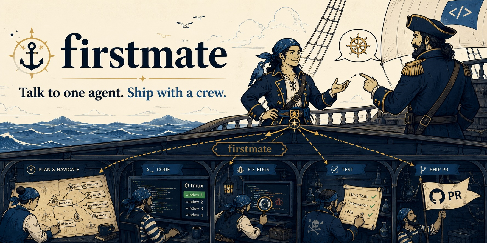

<h1 align="center">firstmate</h1>
<p align="center">
  <a
    href="https://img.shields.io/badge/platform-macOS%20%7C%20Linux-blue?style=flat-square"
    ></a>
  <a href="https://x.com/kunchenguid"
    ></a>
  <a href="https://discord.gg/Wsy2NpnZDu"
    ></a>
</p>

<h3 align="center">Talk to one agent. Ship with a crew.</h3>

<p align="center">
  
</p>

You can run one coding agent easily.
But the moment you want three project tasks done in parallel - fixes, investigations, plans, audits - you become a tab-juggler: babysitting sessions, copy-pasting context between repos, forgetting which terminal had the failing test.

firstmate flips the model.
You talk to a single agent - the first mate - and it runs the crew for you: spawning autonomous agents in a visible backend, giving each a clean git worktree, supervising them to completion, and handing you finished PRs, approved local merges, or standalone investigation reports.
There is no app to install; the whole orchestrator is an `AGENTS.md` file that any terminal coding agent can follow.

- **One liaison** - you never talk to a worker agent.
  The first mate dispatches, supervises, escalates only real decisions, and reports plain outcomes about work that is ready, blocked, or needs your call.
- **A visible crew** - every crewmate lives in a visible backend session.
  Watch any of them work, or type into their session to intervene; the first mate reconciles.
- **Guarded by construction** - the first mate is read-only over your projects except for clean local default-branch refreshes, safe pruning of local branches whose remote is gone, and approved `local-only` fast-forward merges; crewmates work in disposable backend-created worktrees.
  Ship tasks follow each project's delivery mode, and scout tasks produce local reports without pushing anything.

This is not an agent harness. This is not a skill. This is not a CLI.

This is.. a directory that turns any agent into your firstmate, and you the captain.

## Quick Start

```sh
$ git clone https://github.com/kunchenguid/firstmate && cd firstmate
$ claude   # launch your agent harness here; AGENTS.md takes over

> ahoy! look at my github project xyz, then fix the flaky login test and add dark mode

# firstmate checks its toolchain (asking your consent before installing anything),
# clones the project under projects/, and spawns two crewmates in the visible backend
# fm-fix-login-k3 and fm-dark-mode-p7.
# Minutes later:

  PR ready for review, captain: https://github.com/you/xyz/pull/42
  (fix flaky login test - risk: low - CI green)

> alright merge it
```

## Install

**Prerequisites** (the first mate detects everything else and offers to install it):

```sh
# 1. a verified agent harness - claude, codex, opencode, or pi
# 2. git + GitHub auth
# 3. tmux by default, Orca CLI when FM_BACKEND=orca, Codex Desktop when FM_BACKEND=codex-app, or OpenCode when FM_BACKEND=opencode-server
gh auth login
```

**Get firstmate:**

```sh
git clone https://github.com/kunchenguid/firstmate
cd firstmate && claude
```

That is the whole install.
On first launch the first mate detects what its toolchain is missing (tmux/treehouse by default, Orca CLI when `FM_BACKEND=orca`, OpenCode when `FM_BACKEND=opencode-server`, plus no-mistakes, gh-axi, chrome-devtools-axi, lavish-axi), lists it with the exact install commands, and installs only after you say go.
Codex App mode requires running firstmate inside Codex Desktop so the first mate can use the app-owned thread tools.
For `FM_BACKEND=codex-app`, bootstrap checks only the shell-side shared tools; Codex Desktop itself is the visible thread host.

**Run the default tmux backend inside tmux for the best experience.**
firstmate works from any terminal - outside tmux, crewmates land in a detached `firstmate` session you can attach to - but launching your harness from inside tmux puts every crewmate window in your own session, one per task, where you can watch the crew work in real time or type into any window to intervene.

**Or use Orca as the visible backend.**
Set `FM_BACKEND=orca` in the environment, `config/backend`, or `config/backend.env`. The environment wins, then `config/backend`, then `config/backend.env`. In Orca mode, `fm-spawn` creates an Orca-managed worktree and launches the selected agent there, while the rest of firstmate's brief, backlog, status, and delivery protocol stays the same.
When the selected Orca harness is Codex, firstmate handles the trust prompt through the Orca terminal. Set `FM_ORCA_CODEX_AUTO_TRUST=1` only if you explicitly want firstmate to pre-mark Orca worktrees trusted in Codex's Orca runtime config; set `FM_ORCA_CODEX_CONFIG` only if Orca stores that file somewhere nonstandard.

**Or use Codex App threads as the visible backend.**
Set `FM_BACKEND=codex-app` while running firstmate inside Codex Desktop.
In Codex App mode, `fm-spawn` prepares the task metadata and prints the app action to take.
The first mate then uses Codex Desktop's thread tools to create or fork the visible `fm-<id>` thread, send the crewmate brief, and record the returned thread id with `bin/fm-codex-app record-thread`.
If the captain already has a visible thread on deck, firstmate can adopt it with `bin/fm-codex-app adopt-thread`.
This is intentionally not `codex app-server`: app-server can complete headless turns without creating visible, persisted Desktop threads.
`fm-peek` can show cached `read_thread` captures, `fm-send` refuses with the host-tool action to take, `fm-watch` still wakes on status files, and `fm-teardown` requires app archive plus the usual work-safety proof.
This backend runs the Codex harness only; use Orca or tmux for mixed harness fleets.

**Or use OpenCode's native server.**
Set `FM_BACKEND=opencode-server` and dispatch with the `opencode` harness.
In OpenCode server mode, `fm-spawn` creates a disposable git worktree, starts a task-local `opencode serve`, creates or reuses the `fm-<id>` session through the HTTP API, and sends the brief asynchronously.
`fm-peek`, `fm-send`, interrupt, status, and teardown use the same server API; teardown aborts/deletes the session, disposes the server, and removes the firstmate-owned worktree after the normal work-safety checks pass.

## How It Works

```
            you (the captain)
                  │  chat: requests, decisions, "merge it"
                  ▼
 ┌─────────────────────────────────────┐
 │ firstmate            (this repo)    │
 │ reads projects/; writes guarded     │
 │ backlog.md ── briefs ── watcher     │
 └──┬──────────────┬───────────────┬───┘
    │ backend send / status files │
    ▼              ▼               ▼
 ┌────────┐   ┌────────┐      ┌────────┐
 │fm-task1│   │fm-task2│  ... │fm-taskN│   backend sessions you can watch
 │crewmate│   │crewmate│      │crewmate│   one autonomous agent each
 └───┬────┘   └───┬────┘      └───┬────┘
     ▼            ▼               ▼
  backend-created worktree (clean, disposable, parallel-safe)
     │
     ├─ ship: project mode ► PR/local merge ► teardown
     │
     └─ scout: report at data/<id>/report.md ► relay findings ► teardown
```

- **Event-driven supervision** - a zero-token bash watcher (`bin/fm-watch.sh`) sleeps on the fleet and wakes the first mate only when a crewmate reports, stalls, a PR merges, or an internal heartbeat review is due.
  Routine watcher polling, restarts, elapsed waiting time, and unchanged heartbeat reviews stay silent; an idle crew costs you nothing.
  A pull-based guard (`bin/fm-guard.sh`) warns through supervision tool output if tasks are in flight and that watcher stops running.
- **Worktrees, not branches in your checkout** - crewmates never touch your clone; the selected backend creates clean disposable worktrees so parallel tasks on one repo cannot collide.
- **Two task shapes** - ship tasks change projects and ship by project mode (`no-mistakes`, `direct-PR`, or `local-only`); scout tasks investigate, plan, reproduce bugs, or audit, then leave a report at `data/<id>/report.md` and never push.
- **Project modes are explicit** - `data/projects.md` records each project's delivery mode and optional `+yolo` autonomy flag.
  `no-mistakes` projects run the full validation pipeline, `direct-PR` projects open PRs without that pipeline, and `local-only` projects stay local until firstmate performs an approved fast-forward merge.
- **Project memory belongs to projects** - durable project-intrinsic agent knowledge lives in each project's committed `AGENTS.md`, with `CLAUDE.md` as a symlink.
  Ship briefs prompt crewmates to create or update those files through the normal delivery path; `data/projects.md` stays a thin private registry.
- **Local clones stay fresh** - bootstrap and PR-based teardown refresh remote-backed project clones with clean default-branch fast-forwards when the clone is on the default branch and has no local work, and prune local branches whose remote is gone and that no worktree still needs.
- **Restart-proof** - all state lives in the configured backend, status files, and local markdown under `data/`.
  Kill the first mate session anytime; the next one reconciles and carries on.

## The bin/ toolbelt

The first mate drives these; you rarely need to, but they work by hand too.

| Script                   | Description                                                                                                         |
| ------------------------ | ------------------------------------------------------------------------------------------------------------------- |
| `fm-bootstrap.sh`        | Detect missing toolchain pieces; refresh clones best-effort; install tools only after consent                       |
| `fm-fleet-sync.sh`       | Fetch clones, clean-fast-forward their checked-out default branches, and safely prune branches whose remote is gone |
| `fm-brief.sh`            | Scaffold a ship brief, or a report-only scout brief with `--scout`                                                  |
| `fm-ensure-agents-md.sh` | Ensure project `AGENTS.md` is the real memory file and `CLAUDE.md` symlinks to it                                   |
| `fm-guard.sh`            | Warn when tasks are in flight but the watcher liveness beacon is stale or missing                                   |
| `fm-backend.sh`          | Shared backend helpers for tmux, Orca, Codex App, and OpenCode server runtime operations                            |
| `fm-codex-app`           | Dependency-free Codex App visible-thread ledger used to record thread ids, captures, pending worktrees, and archive state |
| `fm-opencode-server`     | Dependency-free OpenCode server helper used to start task servers and drive session HTTP APIs                       |
| `fm-codex-app-smoke-check.sh` | Validate visible-thread smoke evidence so headless app-server turns cannot pass as Codex App backend success    |
| `fm-spawn.sh`            | Create a backend session/worktree, or prepare a Codex App visible-thread handoff; records ship/scout task kind     |
| `fm-project-mode.sh`     | Resolve a project's delivery mode and `+yolo` flag from `data/projects.md`                                          |
| `fm-merge-local.sh`      | Fast-forward a `local-only` project's local default branch after approval                                           |
| `fm-review-diff.sh`      | Review a crewmate branch against the authoritative base, with optional `--stat` output                              |
| `fm-watch.sh`            | Block until supervision work is due; exits with one reason line                                                     |
| `fm-send.sh`             | Send one literal line (or `--key Escape`) to tmux/Orca sessions; Codex App records print the host-tool action      |
| `fm-peek.sh`             | Print a bounded tail of a tmux/Orca session, or a cached Codex App `read_thread` capture                           |
| `fm-pr-check.sh`         | Record a PR-ready task and arm the watcher's merge poll                                                             |
| `fm-promote.sh`          | Promote a scout task in place so it becomes a protected ship task                                                   |
| `fm-teardown.sh`         | Remove or return the worktree and close/archive the backend session; protects ship work and requires scout reports  |
| `fm-harness.sh`          | Detect the running harness; resolve the effective crewmate harness                                                  |
| `fm-lock.sh`             | Single-firstmate session lock                                                                                       |

## Configuration

The shared orchestrator behavior lives in `AGENTS.md` - edit it like any prompt when the fleet is empty, or dispatch shared-repo edits to a crewmate while tasks are in flight.
Personal preferences for one captain's fleet live locally in `data/captain.md`; it is gitignored and read after `data/projects.md` during bootstrap.
Harness support is a table in section 4: claude, codex, opencode, and pi are all empirically verified; new harnesses get verified through a supervised trial task before joining the table.
Backend selection can live in `FM_BACKEND`, `config/backend`, or `config/backend.env`, in that precedence order.

Runtime tuning via environment variables (defaults shown):

```sh
FM_POLL=15              # seconds between watcher cycles
FM_HEARTBEAT=600        # base seconds between fleet reviews; backs off exponentially while idle
FM_HEARTBEAT_MAX=7200   # heartbeat backoff cap
FM_CHECK_INTERVAL=300   # seconds between slow checks (merged-PR polls)
FM_CHECK_TIMEOUT=30     # seconds allowed per slow check script
FM_GUARD_GRACE=300      # seconds a stale watcher beacon may age before guard warnings
FM_SIGNAL_GRACE=30      # seconds to coalesce nearby status and turn-end signals into one wake
FM_FLEET_SYNC_BOOTSTRAP_TIMEOUT=20   # seconds allowed for bootstrap's best-effort clone refresh
FM_FLEET_PRUNE=1        # set to 0 to skip pruning local branches whose upstream is gone
FM_BACKEND=tmux          # visible crew backend: tmux (default), orca, codex-app, or opencode-server
FM_BUSY_REGEX='esc (to )?interrupt|Working\.\.\.|codex-app status: active|opencode-server status: busy'   # busy signatures
FM_OPENCODE_SERVER_HOST=127.0.0.1   # host for task-local opencode serve instances
FM_OPENCODE_SERVER_PORT=0           # 0 picks a free port per task; set only for smoke/debug work
FM_ORCA_CODEX_AUTO_TRUST=0  # set to 1 to pre-trust Orca+Codex worktrees instead of handling the prompt
FM_ORCA_CODEX_CONFIG="$HOME/Library/Application Support/orca/codex-runtime-home/home/config.toml"  # Orca+Codex trust config path
```

## Development

Tracked changes to firstmate itself, including `AGENTS.md`, `README.md`, `CONTRIBUTING.md`, `.github/workflows/`, `bin/`, `docs/plans/`, `test/`, and agent skill files, ship through the `no-mistakes` pipeline on a feature branch and require the captain's explicit merge approval.
When supervising live crewmates, keep long validation or build work in the background so watcher wakes can still be handled.
Human-authored pull requests targeting `main` must be raised through `git push no-mistakes`; see `CONTRIBUTING.md` for the enforced contributor workflow.
Local `.no-mistakes/` state and test evidence stay out of this repo; `.no-mistakes.yaml` keeps evidence in a temp directory instead.

```sh
bash -n bin/*.sh test/*.test.sh            # syntax-check the toolbelt and shell tests
node --check bin/fm-codex-app bin/fm-opencode-server  # syntax-check Node helpers
shellcheck bin/*.sh                       # lint the toolbelt; CI enforces this
for t in test/*.test.sh; do "$t"; done    # run backend and smoke-contract tests
[ "$(readlink CLAUDE.md)" = "AGENTS.md" ]
[ "$(readlink .claude/skills)" = "../.agents/skills" ]
FM_HEARTBEAT=2 FM_POLL=1 bin/fm-watch.sh  # watcher smoke test (prints "heartbeat")
```
