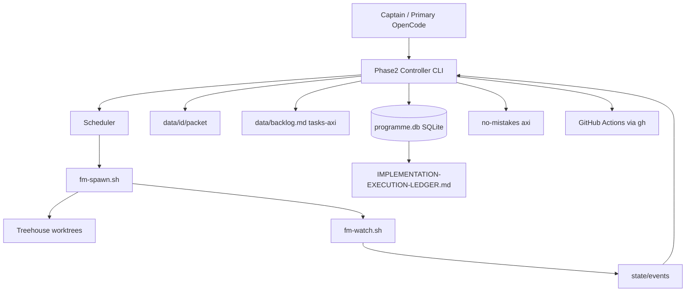

# FirstMate Phase 2 — Target Architecture

## Principle

**Extend, do not replace.** Phase 2 adds a programme control plane beside existing FirstMate spawn/watch/Treehouse/no-mistakes.

## Authorities

| Concern | Authority |
|---------|-----------|
| Machine programme/task state | `state/programme.db` |
| Human ledger | `docs/IMPLEMENTATION-EXECUTION-LEDGER.md` |
| Crew backlog (compat) | `data/backlog.md` via tasks-axi |
| Live endpoint / worktree binding | `state/<id>.meta` (existing) |
| Completion wakes | `.wake-queue` + turn-end (existing) + Phase 2 events |
| Ship validation | no-mistakes + CI |
| Independent review | `packet/REVIEW.md` when programme gate enabled |

## Concurrency defaults (`phase2/config/concurrency.json`)

- max_implementation_workers: 3  
- max_reviewer_workers: 1  
- max_migration_workers: 1  
- deployment_workers: disabled  

Scheduler refuses overlapping `FILE-OWNERSHIP.md` paths and shared-schema tasks in parallel.

## Task states

`planned` → `ready` → `assigned` → `implementing` → `awaiting_tests` → `awaiting_review` → `changes_requested` | `awaiting_ci` → `approved` → `merged`  
Also: `blocked`, `failed`, `cancelled`

Transitions are atomic SQLite updates with an append-only `transitions` audit table.

## Event model

Filesystem queue `state/events/<ts>-<id>-<kind>.json` (+ processed mirror). Idempotent on `(task_id, kind, dedupe_key)`. Optional Unix socket `state/phase2.sock` for immediate notify; watcher polling remains the fallback.
