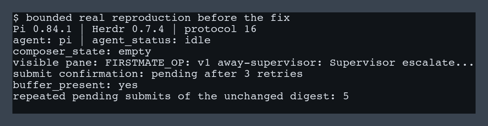
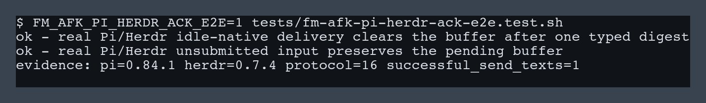

# Pi on Herdr away-mode acknowledgement

*2026-08-10T00:23:10Z by Showboat 0.6.1*
<!-- showboat-id: 5b9dc79e-1f57-4969-9f88-3572426798df -->

The bounded real reproduction reached Pi visibly while Herdr kept the native agent idle and reported the submit as pending.

```bash {image}
before-fix.png
```



The recorded pre-fix negative control returned pending with an empty Pi composer and retained the unchanged buffer.

```bash
printf "pre-fix-negative-control=pending\n"
```

```output
pre-fix-negative-control=pending
```

The corrected path keeps native Herdr confirmation for non-Pi agents and adds only the identity-corroborated Pi composer acknowledgement.

```bash
FM_AFK_PI_HERDR_ACK_E2E=1 ../../tests/fm-afk-pi-herdr-ack-e2e.test.sh 2>/dev/null
```

```output
ok - real Pi/Herdr idle-native delivery clears the buffer after one typed digest
ok - real Pi/Herdr unsubmitted input preserves the pending buffer
evidence: pi=0.84.1 herdr=0.7.4 protocol=16 successful_send_texts=1
```

```bash {image}
after-fix.png
```



The real control leaves an unsubmitted draft pending, while one delivered digest produces exactly one typed send.
