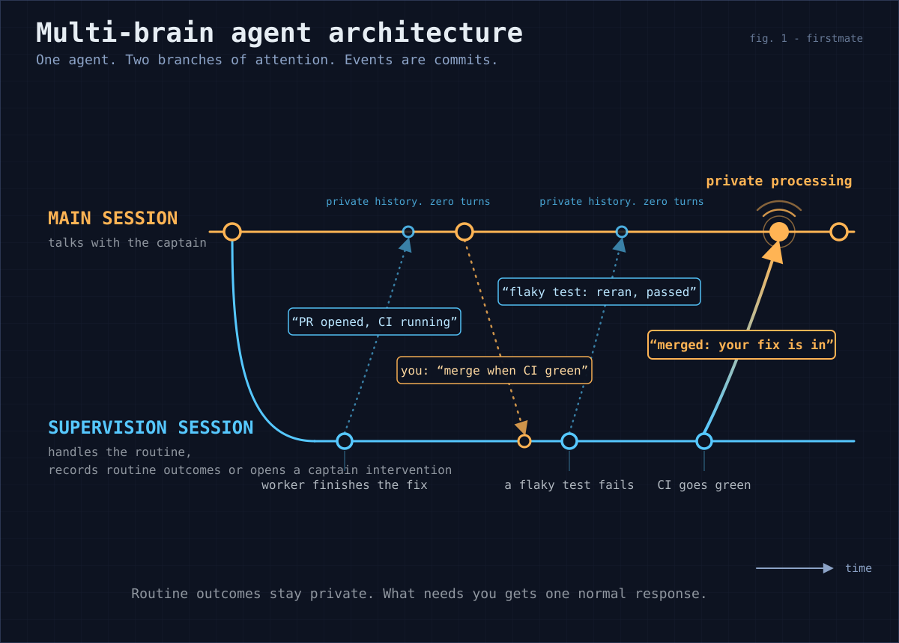

# Pi supervision branch

The poster is the visual of the idea.
This document stays the owner and the contract.

Fleet supervision on the Pi primary harness runs on a second, persistent conversation - the supervision branch - inside the same `pi` process as the captain's chat.
Supervision is default-on: once a Pi primary session owns this home's fleet lock, the branch absorbs every ordinary actionable wake that passes the watcher's unchanged first-stage classifier and resolves wholly to one or more tasks, plus heartbeat scans that the cheap bash-level scan flags as possibly captain-relevant, handles them with real tools, and merges each outcome back by appending a short note to the captain conversation's tail.
Every other fleet-wide or unresolvable wake, and every watcher-failure alarm, stays on main, and only captain-relevant branch outcomes open a turn on main - that follow-up turn is itself the captain-visible outcome, so Pi never separately prints or renders a captain-facing merge note.
The design source is the captain-approved forked-supervision architecture board, a captain-private fleet record (a self-contained HTML explainer with the measured cache and judgment evidence); this document records the shape it landed as, and the delivering PR cites the board artifact itself.

This feature is Pi-only by construction and changes nothing anywhere else:

- The branch lives in `.pi/extensions/fm-branch-supervision.ts`, which only a Pi primary ever loads; no other harness gains or loses behavior.
- The bash-side additions (leases, the outcome store, session-start recovery) are inert in a home that never runs the branch: no lease files exist, no actor variable is set, every guard passes silently, and no new state appears (`tests/fm-branch-supervision.test.sh` holds this).
- It does not change which harness is primary and never moves a home to Pi.

## Components and their owners

- Wake dispatch: `.pi/extensions/fm-primary-pi-watch.ts` stays the dispatcher; `.pi/extensions/lib/fm-branch-dispatch.ts` owns the offer handshake.
  An accepted offer transfers wake ownership to the branch; no acceptor (extension absent, away mode, branch broken, or any drain containing a fleet-wide or unresolvable row other than heartbeat) keeps today's wake-to-main path, and watcher-failure alarms always go to main because only main can repair the watcher cycle.
- The branch itself: `.pi/extensions/fm-branch-supervision.ts` creates and reopens the persistent branch session, serializes wakes, mirrors dialog, and merges outcomes.
  It checks the current extension generation and `state/.lock` ownership before each guarded branch side effect so replacement or lock loss cannot let an old continuation mutate the new session.
  Every path that cannot reach a working branch falls back to delivering the wake to main - a broken branch degrades to today's behavior, never to a lost wake.
- Branch system prompt: `bin/fm-branch-prompt.sh`; its header owns the byte-stable-prefix contract (no timestamps, no fleet snapshot, no per-wake content).
- Outcome store: `bin/fm-branch-outcome.sh`; its header owns the append-only format, the read cursor, and the claim anchor that keeps a delivered outcome honest (see "Freshness at delivery" below).
  Outcomes are written to the store before any note is handed to Pi, and rows that never reach that handoff replay once through the next locked session-start digest.
- Consistency: `bin/fm-lease-lib.sh` owns the per-task lease contract, the main-only role partition, and the deliberate CONFUSED-AGENT-GRADE threat model these guards target (captain-decided; adversarial-grade separation is out of scope and tracked as follow-up design work); `bin/fm-lease.sh` is the command surface.
  The guards are wired into `fm-send.sh`, `fm-control.sh`, and `fm-teardown.sh` (overlap, lease-checked, with claim serialization retained through the mutation) and `fm-pr-merge.sh`, `fm-merge-local.sh`, and `fm-spawn.sh` (main-owned, branch refused; a relaunch through `fm-control` stays branch-legal recovery).
- Autonomy: supervision is default-on for every task once a Pi primary session owns the fleet lock (docs/configuration.md "Pi supervision branch"); no captain grant file is required.
  A fleet-wide heartbeat is separately eligible only when the unread queue contains heartbeat rows and resolvable task-local rows (see "Heartbeat routing" below); every other fleet-wide or unresolvable wake, and every watcher-failure alarm, stays on main.
  The branch repeats that full-queue eligibility check immediately before prompting the branch to drain, and a newly observed main-owned row defers the whole queue to main.
  A producer can still append a row in the instant between that final check and drain startup; this accepted residual follows the confused-agent-grade boundary above rather than claiming adversarial queue isolation.
  Away mode and a broken branch keep today's wake-to-main behavior.

## How the branch knows what the captain said

Main's captain and assistant text - never tool calls, tool results, operational injections, or the branch's own merged notes - is mirrored into the branch as read-only `fm-main-mirror` messages at main's turn end, before the next wake is handed over.
The mirror cursor is durable (`state/.branch-mirror-cursor`), so a restart replays only the not-yet-mirrored dialog from main's session file, and a replacement main session re-anchors from its start.
The branch prompt frames mirrored text as context for judgment, never as instructions addressed to the branch; an authorization addressed to main (for example "you may merge when green") does not relax the branch's role limits.

## Two-stage noise filter

Stage one is unchanged: the bash watcher absorbs everything provably fine at zero token cost.
Stage two is the branch's verdict on each handled event, reported through its `fm_branch_report` tool: `routine` merges without a follow-up turn, while `captain` merges with exactly one follow-up turn.
A note is only ever handed to Pi while the captain's conversation is idle; one reported mid-run is held by the extension and delivered only at `agent_settled` after `isIdle()` confirms that retries, compaction, and queued continuations are finished, so it never steers a running turn and its claim can still be re-checked first.
The follow-up turn a `captain` verdict opens is itself the captain-visible outcome, so its merge note is delivered silently and never printed or rendered in Pi.
A no-change heartbeat outcome explicitly reported with `task=fleet` and `silent=true` is also delivered silently with no rendered note, while every other `routine` outcome stays rendered with its sailboat prefix.
The verdict criteria in the branch prompt mirror the captain-etiquette escalation list; doubt escalates.
Main can read the durable outcome store on demand through its `fm_branch_outcomes` tool.

## Heartbeat routing

The cheap bash-level heartbeat scan absorbs a genuinely no-op pass before it reaches Pi, unchanged from before.
Only a scan already flagged as possibly captain-relevant emits the bare `heartbeat` wake; `.pi/extensions/fm-primary-pi-watch.ts` flags that offer `heartbeat: true`, and the branch accepts it without a project only when every row observed in the unread-queue eligibility check is either heartbeat-kind or a resolvable task-local signal or stale event.
The branch runs its normal operating procedure for the wake (`bin/fm-branch-prompt.sh` "Handling a wake") and performs the deeper fleet review that main previously performed.
A review that found literally nothing worth reporting uses verdict `routine`, `task=fleet`, and `silent=true` so it has no rendered note, while a fleet-wide routine action omits `silent` and keeps its rendered sailboat note.
Only a captain-worthy finding reports verdict `captain` and opens a main turn.
Every other fleet-wide or unresolvable wake - including watcher-failure alarms, which are never offered to the branch - keeps today's wake-to-main path.

## Freshness at delivery

An outcome is recorded the moment the branch judges its claim true and delivered later, so the two are not the same instant.
The fleet keeps moving inside the captain's running turn: the PR a note calls review-ready can merge, and the finished task can be torn down, before that turn ends.
A note delivered afterwards would state a claim that has since become false.

Every delivery therefore re-checks the claim instead of trusting the recorded text, against the task's **claim anchor**: the durable records that decide whether a task-local claim is still current, owned by `bin/fm-branch-outcome.sh`'s header.
A merged PR and a torn-down task both move the anchor; ordinary progress on the task does not, so a routine note is not invalidated by mere activity.
A fleet-wide outcome carries no task-local claim and is never treated as stale.

Both delivery paths apply it.
The extension queues every note through one delivery boundary and re-checks it immediately before handoff, either synchronously while main remains idle or at an idle-confirmed `agent_settled` event after a running turn: a `routine` note found stale is dropped, because it is noise by definition and the durable row still holds it for `fm_branch_outcomes`, while a `captain` note found stale still opens its one turn - suppressing it could bury a real terminal result - carrying an explicit supersession marker that sends main back to the task's current state instead of the recorded claim.
The anchor read and the handoff are not atomic, so an anchor-mutating transition in that instant can still let one already-checked note through.
This accepted residual follows the same confused-agent-grade boundary as the producer/drain residual above rather than claiming adversarial isolation, and it bounds the exposure to that instant instead of the whole captain turn that produced the reported failure.
The locked session-start replay applies the same check to rows that never reached a handoff at all, emitting a stale row with `"superseded":true` added rather than relaying it as current; the stored line is never rewritten.
An anchor that cannot be computed is empty and never reads as stale, so an unverifiable claim is delivered unchanged rather than suppressed.

## Cost model and the byte-stable prefix

The captain accepted the normal provider prompt-caching strategy: a byte-identical branch prefix generated once per firstmate version, the same tool set in the same order on every request, and one shared `prompt_cache_key` per home for all branch sessions (set in a `before_provider_request` hook, and only for providers whose requests already carry that field); main keeps its own per-session key.
Budget roughly 60% cache hits on a fresh branch session's first call and 95% on later calls of the persistent session; reuse is best-effort, never guaranteed.
No caching machinery beyond this exists, deliberately: any later dynamic content in the branch prefix silently removes most of the cache benefit, which is why `bin/fm-branch-prompt.sh`'s header is the contract's single owner and `tests/fm-branch-supervision.test.sh` pins the output to byte identity.

## Away mode

Away mode carries over unchanged: while `state/.afk` exists the away daemon owns supervision, and the branch declines every wake offer for the duration.
What is new is only the attended path: outside away mode, the branch absorbs the routine majority that previously interrupted the captain's conversation, applying the same escalation etiquette the daemon applies while away.

## Verification

Portable regressions: `tests/fm-pi-branch-extension.test.sh` (dispatch, default-on eligibility, fallback, filter, delivery-time freshness, mirror, cache key, persistence), `tests/fm-branch-supervision.test.sh` (prompt stability, store append-only, claim anchors and superseded replay, leases, guards, non-branch-home invariance), the branch-offer and heartbeat-offer tests in `tests/fm-pi-watch-extension.test.sh`, and the recovery test in `tests/fm-session-start.test.sh`.
Live guard: `FM_PI_BRANCH_LIVE_E2E=1 tests/fm-pi-branch-live-e2e.test.sh` exercises the real installed Pi SDK with no credentials and no provider call; run it after every Pi upgrade and record the dated result in [docs/verification/runtime-backends.md](verification/runtime-backends.md).
The strict typecheck in `tests/fm-pi-primary-types.test.sh` pins the extension against the installed Pi package.
