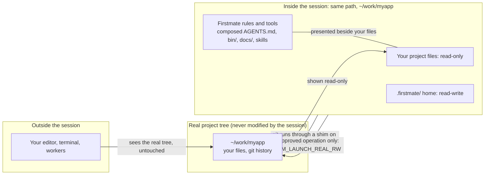

# Project Local: run Firstmate from any project

Project Local lets you type `firstmate` inside any repository or org folder and get a first mate that works on that project, with its own backlog and memory, without moving or cloning anything.
This page is the friendly walkthrough.
Paths in the examples are shortened to `~/work/...`; files that must hold an absolute path show one.
Exact schemas and contracts live in [docs/configuration.md](configuration.md#project-local-homes-the-launcher-and-the-projects-root), and this page links there instead of repeating them.

## Quick start

Three steps take you from nothing to a running session in one repository.

```sh
git clone https://github.com/kunchenguid/firstmate ~/firstmate && mkdir -p ~/.local/bin && ln -sf ~/firstmate/bin/firstmate ~/.local/bin/firstmate
cd ~/work/myapp && firstmate init
firstmate
```

The first step is a one-time install; skip it if `firstmate --help` already works.
The second step prints this, confirming the repository now has its own home:

```text
firstmate: created ~/work/myapp/.firstmate
firstmate: registered myapp in ~/work/myapp/.firstmate/data/projects.md
```

The third step opens your agent tool at the repository root, and its session start shows `Launch mode: project`.
It needs `~/.local/bin` on your `PATH`, plus your agent tool and the other [README requirements](../README.md#requirements).
Details are in [Install and set up](#install-and-set-up); for a folder of several repositories, follow [Example 2](#example-2-an-org-folder-of-several-repositories).

## Contents

- [Quick start](#quick-start)
- [What problem it solves](#what-problem-it-solves)
- [Install and set up](#install-and-set-up)
- [Example 1: a single repository](#example-1-a-single-repository)
- [Example 2: an org folder of several repositories](#example-2-an-org-folder-of-several-repositories)
- [Example 3: registering projects](#example-3-registering-projects)
- [Example 4: an org second mate](#example-4-an-org-second-mate)
- [The two launch modes](#the-two-launch-modes)
- [What is read-only, and why](#what-is-read-only-and-why)
- [How git behaves inside a session](#how-git-behaves-inside-a-session)
- [Where state and memory live](#where-state-and-memory-live)
- [One-time trust prompts](#one-time-trust-prompts)
- [Platform support](#platform-support)
- [Troubleshooting](#troubleshooting)
- [FAQ](#faq)

## What problem it solves

Without Project Local, Firstmate is a directory you live inside.
You clone it, `cd` into the clone, start your agent tool there, and every project it manages is cloned again under `projects/`.
All your work shares one backlog, one set of preferences, and one memory.

That breaks down quickly:

- Client work, an employer's org, and personal experiments should not see each other's backlog or notes.
- The repositories already exist somewhere on disk, and a second clone of each is noise.
- The agent session starts in the Firstmate folder, not in the project you are thinking about.

Project Local changes three things:

| Before | With Project Local |
|---|---|
| One home for everything, inside the Firstmate clone | One home per project or org, in a `.firstmate/` folder beside the code |
| Projects cloned again under `projects/` | Projects used where they already live |
| Session always starts in the Firstmate clone | Session starts inside your project or org, with the Firstmate rules loaded |

## Install and set up

### 1. Install the `firstmate` command once

Clone Firstmate anywhere and put its launcher on your `PATH` with a symlink:

```sh
git clone https://github.com/kunchenguid/firstmate ~/firstmate
mkdir -p ~/.local/bin
ln -s ~/firstmate/bin/firstmate ~/.local/bin/firstmate
```

Make sure `~/.local/bin` is on your `PATH`, then check it:

```sh
firstmate --help
```

```text
usage: firstmate [--global] [--harness <name>] [--mode project|install] [harness args...]
       firstmate init [--org]
```

The launcher follows its symlink back to the clone, so updating the clone updates the command.
You still need the tools listed in the [README requirements](../README.md#requirements), such as your agent tool and the GitHub CLI.

### 2. Create a home where you work

A home is a `.firstmate/` folder that holds one scope's backlog, preferences, and worker records.
Pick the shape that fits:

| You have | Run this | Where it goes |
|---|---|---|
| One standalone repository | `firstmate init` anywhere inside it | `<repo>/.firstmate/`, with the repository registered automatically |
| A folder holding several repositories | `firstmate init --org` in that folder | `<org>/.firstmate/`; the repositories are found, and you register the ones Firstmate may work on |
| Nothing in particular | Nothing | The global home: `~/.firstmate` when it exists, else the Firstmate clone itself |

### 3. Launch

```sh
cd ~/work/myapp
firstmate
```

The launcher finds the nearest `.firstmate/` above your directory, picks your agent tool, and starts it.
Claude Code is the default tool; choose another per launch with `--harness`, or per home with a one-word `config/primary-harness` file:

```sh
firstmate --harness pi
echo omp > .firstmate/config/primary-harness
```

Anything after the launcher's own flags goes straight to the tool, so put `--global`, `--harness`, and `--mode` first:

```sh
firstmate --harness claude --resume     # --resume reaches claude
```

### The one-time trust marker

`firstmate init` writes an empty file, `.firstmate/.fm-home`, that git never tracks.
The launcher honors a `.firstmate/` it finds above you only when that marker is present and untracked.

Why: a `.firstmate/` can carry settings, such as which program to launch or where the backlog lives.
If a repository you clone came with a committed `.firstmate/`, those settings would otherwise take effect the moment you typed `firstmate` inside it.
With the marker rule, a committed `.firstmate/` does nothing on your machine until you bless it once by running `firstmate init` in that repository:

```sh
firstmate init
```

On a folder that already has `.firstmate/`, `init` changes nothing that exists.
It writes the missing marker, creates only the scaffold pieces that are absent, and prints which committed settings, such as `config/primary-harness` or a `.tasks.toml` backlog setting, the home will now honour.
Running it again reports that the home is already trusted.
It refuses a `.firstmate/` that is a symlink or not a folder.

A marker that was committed to git does not count, because it proves nothing about your machine.
An explicit `FM_HOME=...` and the global home need no marker.
Even a blessed home can only launch one of the supported agent tools, never an arbitrary program.

### Sharing settings with a team

`.firstmate/` is private by default: its own `.gitignore` ignores everything, including itself, so `git status` stays clean after `firstmate init`.
To share one setting, add an exact-path exception and commit both files once:

```sh
echo codex > .firstmate/config/primary-harness
echo '!config/primary-harness' >> .firstmate/.gitignore
git add -f .firstmate/.gitignore .firstmate/config/primary-harness
git commit -m "Share the Firstmate harness choice"
```

Each teammate then runs `firstmate init` once after cloning; until they do, the shared setting is ignored and the launcher refuses the home.
`data/` and `state/` are never shared.
[docs/configuration.md](configuration.md#initialization-the-projects-root-and-discovery) owns the whitelist rules.

## Example 1: a single repository

A repository with no home yet:

```text
$ cd ~/work/myapp
$ firstmate
firstmate: no .firstmate/ home found above ~/work/myapp.
  Run 'firstmate init' at a repo root for a per-project home,
       'firstmate init --org' at an org root, or 'firstmate --global' for the global home.
```

Create the home:

```text
$ firstmate init
firstmate: created ~/work/myapp/.firstmate
firstmate: projects root is ~/work/myapp (config/projects-root=..)
firstmate: registered myapp in ~/work/myapp/.firstmate/data/projects.md
firstmate: run `firstmate` from anywhere under ~/work/myapp to launch against this home
```

The repository registers itself as `local-only` when it has no `origin` remote, and as `no-mistakes-prod-only` when it has one:

```text
$ cat .firstmate/data/projects.md
- myapp [local-only] - this repository (added 2026-09-24)
$ git status --short
$
```

Launch from anywhere inside it, even a subdirectory:

```sh
cd ~/work/myapp/src/deep
firstmate
```

The session opens at the repository root, `~/work/myapp`, because tools load their settings only from the directory they start in.
The first mate runs its session start and shows a LAUNCH CONTEXT section:

```text
================================================================================
LAUNCH CONTEXT
================================================================================
Launch dir: ~/work/myapp
Repo root: ~/work/myapp
Working project: ~/work/myapp
Launch mode: project (the session runs at ~/work/myapp through a Firstmate view; that directory is read-only here except its .firstmate/)
Project alias: myapp
Registry: registered in this home
Project instructions: loaded natively through the Firstmate view (the composed AGENTS.md carries the Firstmate contract, then the launch directory's own AGENTS.md/CLAUDE.md)
Shadowed launch-directory entries (the real ones are readable under FM_LAUNCH_REAL=/run/user/1000/firstmate-view.12345/ro):
  AGENTS.md - folded into the composed AGENTS.md: /run/user/1000/firstmate-view.12345/ro/AGENTS.md
```

From here you talk to it as usual: "fix the checkout bug in myapp" becomes a worker in an isolated copy of the repository, and the fix comes back as a branch or pull request, depending on the project's delivery mode.

## Example 2: an org folder of several repositories

```text
~/work/acme/
  webapp/        a git repository
  api/           a git repository
  infra/         a git repository
```

Create one home for the whole folder:

```text
$ cd ~/work/acme
$ firstmate init --org
firstmate: created ~/work/acme/.firstmate
firstmate: projects root is ~/work/acme (config/projects-root=..)
firstmate: discoverable sibling repos: api infra webapp
firstmate: discovery is not authority - register each project in ~/work/acme/.firstmate/data/projects.md before firstmate may refresh, spawn, seed, or land it
firstmate: run `firstmate` from anywhere under ~/work/acme to launch against this home
```

Found is not the same as allowed.
Firstmate lists every repository in the folder, but it refreshes, works on, or lands only the ones you register ([Example 3](#example-3-registering-projects)).

Launch from the org folder, and the session opens at `~/work/acme` with every repository visible:

```text
$ cd ~/work/acme
$ firstmate
```

The session-start digest names the org and summarizes each registered project in one or two lines, rebuilt at every start; this is how it looks once the projects are registered as in [Example 3](#example-3-registering-projects):

```text
LAUNCH CONTEXT
================================================================================
Launch dir: ~/work/acme
Launch mode: project (the session runs at ~/work/acme through a Firstmate view; that directory is read-only here except its .firstmate/)
Org root: ~/work/acme
Org projects: ORG PROJECTS, after the CONTEXT digest below
...
ORG PROJECTS - derived at this session start (bin/fm-projects.sh summary)
--------------------------------------------------------------------------------
  - api [direct-PR +yolo] - Go - in flight: none
    CLAUDE.md: Billing API in Go.
  - shared-lib [direct-PR] - Rust - in flight: none
    AGENTS.md: # shared-lib
  - webapp [no-mistakes] - TypeScript - in flight: none
    AGENTS.md: # webapp
  Unregistered sibling repos (offer the captain to register them; project-management owns registration): infra
```

Launching from inside one repository of the org still uses the org's home, but opens the session in that repository:

```sh
cd ~/work/acme/webapp
firstmate        # home: ~/work/acme/.firstmate, session root: ~/work/acme/webapp
```

A repository can also have its own home inside the org, which then wins for launches under it:

```text
$ cd ~/work/acme/api
$ firstmate init
firstmate: created ~/work/acme/api/.firstmate
firstmate: projects root is ~/work/acme/api (config/projects-root=..)
firstmate: note - launches under ~/work/acme/api now resolve to this home, shadowing ~/work/acme/.firstmate
...
```

## Example 3: registering projects

The easiest way is to ask the first mate: "register infra as direct-PR".
It follows its project-management procedure, which asks about anything it cannot infer.

You can also edit the registry yourself.
It is one line per project in `.firstmate/data/projects.md`, with the delivery mode in brackets:

```text
- webapp [no-mistakes] - customer storefront (added 2026-09-24)
- api [direct-PR +yolo] - billing API (added 2026-09-24)
```

| Mode | What a finished task becomes |
|---|---|
| `no-mistakes` | A pull request after the full review and test pipeline |
| `direct-PR` | A pull request without the pipeline |
| `local-only` | A ready local branch, no remote |
| `no-mistakes-prod-only` | The first mate picks per task: pipeline for product work, direct pull request for internal tooling |

`+yolo` lets the first mate merge green, in-scope work itself; without it, you approve every merge.
The [`bin/fm-project-mode.sh`](../bin/fm-project-mode.sh) header owns the exact line format.

### A sibling repository

A repository inside the org folder needs only its registry line, because its name is its folder name:

```text
- infra [direct-PR] - Terraform for acme (added 2026-09-24)
```

### A repository outside the org folder

Give it a registry line and map its name to its absolute path in `.firstmate/data/project-paths.json`:

```text
- shared-lib [direct-PR] - shared utilities, lives outside the org (added 2026-09-24)
```

```json
{
  "shared-lib": "/home/me/work/oss/shared-lib"
}
```

Check what the home sees with the project tool from your Firstmate clone:

```text
$ cd ~/work/acme
$ export FM_HOME="$PWD/.firstmate"
$ ~/firstmate/bin/fm-projects.sh discover      # found in the folder
api
infra
webapp
$ ~/firstmate/bin/fm-projects.sh aliases       # registered
api
shared-lib
webapp
$ ~/firstmate/bin/fm-projects.sh resolve shared-lib
/home/me/work/oss/shared-lib
$ ~/firstmate/bin/fm-projects.sh summary       # the digest's org summary
```

An unregistered repository is refused by name and by path:

```text
$ ~/firstmate/bin/fm-fleet-sync.sh infra
error: ~/work/acme/infra is not a registered project of this home; register it in ~/work/acme/.firstmate/data/projects.md (or data/project-paths.json) before refreshing
```

[docs/configuration.md](configuration.md#initialization-the-projects-root-and-discovery) owns the resolution order and the manifest format.

## Example 4: an org second mate

A second mate is a long-lived helper first mate with its own home and a charter, for example "all storefront work at acme".
Ask the first mate in the org session:

> Create a second mate for acme storefront work, covering webapp and shared-lib.

Underneath, it seeds an org-shaped home that uses the same repositories in place, without cloning them:

```text
$ FM_HOME="$PWD/.firstmate" FM_SECONDMATE_CHARTER='Storefront work for acme' \
    ~/firstmate/bin/fm-home-seed.sh acme-web ~/work/mates/acme-web webapp shared-lib --projects-root ~/work/acme
scaffolded: ~/work/acme/.firstmate/data/acme-web/brief.md (secondmate charter)
home=~/work/mates/acme-web
```

The new home inherits exactly what the org home registered, including the outside repository's path:

```text
$ cat ~/work/mates/acme-web/config/projects-root
/home/me/work/acme
$ cat ~/work/mates/acme-web/data/projects.md
- webapp [no-mistakes] - customer storefront (added 2026-09-24)
- shared-lib [direct-PR] - shared utilities, lives outside the org (added 2026-09-24)
$ cat ~/work/mates/acme-web/data/project-paths.json
{
  "shared-lib": "/home/me/work/oss/shared-lib"
}
```

Seeding refuses a project the org home has not registered, a `local-only` project, and a `no-mistakes` project with no `origin` remote, each with a one-line reason ([Troubleshooting](#troubleshooting)).
The first mate then launches and supervises the second mate for you; [docs/remote-secondmates.md](remote-secondmates.md) covers second mates on another machine.

## The two launch modes

In project mode the same project path looks different depending on who is looking:



Ordinary writes to project files fail in the session; only `.firstmate/` is writable, and an approved operation writes through a separate writable alias of the real tree.
Git commands go straight to the real tree, so `git status` stays clean and no view file can be added.

| | Project mode | Install mode |
|---|---|---|
| Session starts in | Your project or org folder | The Firstmate clone |
| How the rules load | Natively: the folder presents Firstmate's rules to every tool | Natively from the clone, plus a project summary in the digest |
| Your project's own instructions | Loaded after Firstmate's, in the same file | Shown as a 50-line excerpt in the digest |
| Project files in the session | Read-only, enforced | Writable by path; the rule forbids edits but nothing blocks them |
| Needs | Linux with unprivileged user and mount namespaces | Nothing extra |

### How a mode is chosen

1. `--mode project` or `--mode install` on the command line.
2. Otherwise the home's `config/launch-mode` file, one word, `project` or `install`.
3. Otherwise project mode when this machine can build it, and install mode with a notice when it cannot.

```sh
firstmate --mode install                         # this launch only
echo install > .firstmate/config/launch-mode     # this home, every launch
```

A few launches always use install mode, without a notice:

- A launch outside any repository and outside an org folder, for example from `/tmp` with the global home.
- A launch inside the Firstmate clone itself.
- A launch inside another Firstmate clone, which runs as its own install, with a note: `firstmate: <dir> is a Firstmate checkout; running it as its own install root`.

### The fallback notice

When nothing asked for a mode and this machine cannot build project mode, the launcher says why on one line and continues in install mode:

```text
firstmate: notice: project mode unavailable (this host refuses an unprivileged user+mount namespace: unshare: write failed /proc/self/uid_map: Operation not permitted); running in install mode from ~/firstmate
```

The session-start digest repeats it, so the first mate knows too:

```text
Launch mode: install (the session runs at the install root ~/firstmate)
Launch notice: project mode unavailable (this host refuses an unprivileged user+mount namespace: ...); running in install mode from ~/firstmate
```

In install mode the digest also names your project's instructions file and prints the start of it:

```text
Project instructions: ~/work/myapp/AGENTS.md
Excerpt: LAUNCH INSTRUCTIONS EXCERPT, after the CONTEXT digest below
...
LAUNCH INSTRUCTIONS EXCERPT - ~/work/myapp/AGENTS.md (first 50 lines)
--------------------------------------------------------------------------------
  # myapp
  A small web app.
```

When you ask for project mode explicitly on a machine that cannot build it, the launcher stops instead of falling back:

```text
$ firstmate --mode project
firstmate: project mode unavailable: this host refuses an unprivileged user+mount namespace: unshare: write failed /proc/self/uid_map: Operation not permitted
```

### What the session sees in project mode

Only the session sees this; your editor, other terminals, workers, and CI keep seeing the real folder.

| At the project root | In the session |
|---|---|
| `AGENTS.md` | Firstmate's rules, then a "Launch directory instructions" header, then your own `AGENTS.md`, `AGENTS.override.md`, `CLAUDE.md`, `CLAUDE.local.md`, and `.claude/CLAUDE.md` |
| `CLAUDE.md` | Firstmate's one-line pointer to `AGENTS.md` |
| `bin/`, `docs/` | Firstmate's, merged with yours; Firstmate wins a same-named file |
| `.agents/ .claude/ .codex/ .cursor/ .grok/ .opencode/ .pi/ .omp/` | Firstmate's |
| `.mcp.json`, `opencode.json`, `opencode.jsonc`, `AGENTS.override.md`, `CLAUDE.local.md` | Hidden (the two instruction files still reach every tool once, folded into `AGENTS.md`) |
| `.firstmate/` | Your home, writable |
| Everything else | Your real files, read-only |

Anything shadowed is still readable at its real path under `$FM_LAUNCH_REAL`, and the digest lists each one.
Your project's own hooks, skills, and MCP servers are for the workers, which load them normally in their own copies of the repository.
Files created, replaced, or deleted outside the session show up inside it within about two seconds.
[`bin/fm-view.sh`](../bin/fm-view.sh) owns the exact layout.

## What is read-only, and why

In project mode, the first mate's session cannot change your project:

```text
$ touch notes.txt
touch: cannot touch 'notes.txt': Read-only file system
$ touch bin/x
touch: cannot touch 'bin/x': Read-only file system
$ touch .firstmate/state/ok      # works: the home is writable
```

| Path | In the session |
|---|---|
| Your project files | Read-only |
| Firstmate's presented rules, scripts, and tool folders | Read-only |
| `.firstmate/` | Writable |
| `$FM_LAUNCH_REAL` | Your real project, read-only |
| `$FM_LAUNCH_REAL_RW` | Your real project, writable, reserved for an edit you approve in the moment |

The presented Firstmate surface is read-only everywhere in the session, including Firstmate's scripts merged into your own `bin/` or `docs/`: writing through `bin/fm-spawn.sh` fails like any other write.
The Firstmate install root itself stays writable, because the global home can live there and self-update replaces it; only Firstmate's own scripts reach it, through `FM_ROOT_OVERRIDE`, never a path presented in the session.

Why: Firstmate's first rule is that the first mate never writes to a project; workers change code in isolated copies and deliver it through the project's delivery mode.
Project mode turns that rule from a promise into a guarantee against accidents.
It is a guard against mistakes, not a sandbox against a determined program: git and `$FM_LAUNCH_REAL_RW` still reach the real files.
When you tell the first mate to make one specific change directly, it uses `$FM_LAUNCH_REAL_RW` for exactly that change.
The rule itself is in [`AGENTS.md`](../AGENTS.md) hard rule 1.

## How git behaves inside a session

Git sees your real repository, at the same path, in both modes.

```text
$ git status --short          # clean: none of Firstmate's files appear
$ git rev-parse --show-toplevel
~/work/myapp
$ git show HEAD:AGENTS.md     # your real AGENTS.md
```

- `git status` never lists the rules, scripts, or tool folders the session presents, and `git add -A` cannot stage them.
- A worktree or branch made from inside the session is real and valid outside it; that is how workers get their isolated copies.
- Refreshing a registered project (fetch and fast-forward) works from inside, and in an org home it touches only clean checkouts on their default branch.
- Git can still write, so the first mate's rules, not the file system, keep it from committing to your project.
- Each git call costs about 5 ms more inside the session.
- Every call to the `git` program the session found at start is redirected, whatever path it is called by; a second git install, or a library-based git tool, sees the session's folder instead, where `.git` is read-only, so its writes fail rather than do damage.

## Where state and memory live

| What | Where |
|---|---|
| Backlog, preferences, learnings, second mate list | The home's `data/` (`.firstmate/data/` for a project or org home) |
| Worker records and notifications | The home's `state/` |
| Local choices such as `primary-harness` and `launch-mode` | The home's `config/` |
| The session's temporary folder view | `$XDG_RUNTIME_DIR/firstmate-view.<pid>`, else under `$TMPDIR` or `/tmp`, removed when the session ends |
| Worker copies of the repository | Isolated worktrees, the same as before |
| Firstmate's own code and rules | The Firstmate clone, shared by every home |

Memory:

- The first mate keeps what it learns about you and your projects in the home's `data/captain.md` and `data/learnings.md`, so each project or org has its own.
- Claude Code's automatic per-folder memory is turned off for every session the `firstmate` launcher starts, in both modes. Claude keys that memory by folder, so in install mode every org and project would share one memory under the install directory, and in project mode it would be shared with your plain Claude Code sessions in the same folder. A Claude Code session you start without the launcher keeps its usual memory.
- Your agent tool's own per-folder history (transcripts, "continue last session") is keyed by the project folder in project mode and by the Firstmate clone in install mode.
  A plain `claude --continue` in your project can therefore pick up a first-mate conversation, and it will run without the Firstmate rules.

## One-time trust prompts

In project mode each tool treats every project as a new workspace, so it asks its usual trust question once per project path.
In install mode it asks once, for the Firstmate clone.

| Tool | What it asks | What to do |
|---|---|---|
| Claude Code | Trust this folder | Accept once per project |
| Codex | Trust this project, then review its hooks | Accept both; the hook review comes back after Firstmate's hooks change |
| Pi, `pi-signed` | Trust this project so its extensions load | Accept once per project |
| Grok | Trust this folder | Launch with `firstmate --harness grok --trust` once, or use `/hooks-trust` |
| Cursor Agent CLI | Workspace trust, required for its hooks | Launch with `firstmate --harness cursor --trust` |
| Oh My Pi (`omp`) | Nothing | - |
| OpenCode | Nothing expected; not yet tested in project mode | - |

Codex also gets `-c project_doc_max_bytes=262144` from the launcher in both modes, because by default it reads only the first 32 KiB of `AGENTS.md` and would miss most of the rules.

## Platform support

| Platform | Project mode | What happens |
|---|---|---|
| Linux (Debian, Fedora, Arch, and others with unprivileged user namespaces) | Yes | Needs util-linux 2.38 or newer |
| Windows through WSL2 | Yes | Tested |
| Ubuntu 23.10 and newer, native | No, by default | AppArmor's `kernel.apparmor_restrict_unprivileged_userns=1` blocks it; install mode with a notice |
| macOS | No | No per-process mounts exist; install mode with a notice |
| Docker and similar containers with the default seccomp profile | No | Install mode with a notice |

Install mode works everywhere Firstmate works.
Inside a project-mode session, `sudo` does not work and files owned by root show as `nobody`; run anything that needs `sudo` from a separate terminal.
Projects on a Windows drive mounted in WSL (`/mnt/c/...`) have not been tested.

## Troubleshooting

Each entry starts with the exact line you will see.

### Launcher errors

**`firstmate: no .firstmate/ home found above <dir>.`**
You are inside a repository with no home above it.
Run `firstmate init` for this repository, `firstmate init --org` in the folder that holds it, or `firstmate --global` to use the global home.

**`firstmate: untrusted home: <home> has no local (untracked) .fm-home marker.`**
The `.firstmate/` above you was not created on this machine, usually because it came with a clone.
If you trust it, run `firstmate init` there; it writes the marker and lists the committed settings the home will honour.
A `.fm-home` that is tracked by git does not count: untrack it, then run `firstmate init` again.

**`firstmate: <dir>/.firstmate exists but is not a plain directory`** (or a piece of it is a symlink)
`firstmate init` never overwrites a home and refuses to bless a symlinked one.
Replace the symlink with a real folder, or launch with an explicit `FM_HOME`.

**`firstmate: firstmate init must run inside a git repository (or use --org at an org root)`**
Plain `init` makes a per-project home at a repository root.
Use `firstmate init --org` for a folder of repositories.

**`firstmate: harness is not primary-capable: <name> (primary-capable: claude codex opencode pi pi-signed grok cursor omp)`**
The name came from `--harness` or `config/primary-harness`, and only those tools can run a first mate.
Worker-only tools such as `gemini` and `kimi` are refused here.

**`firstmate: harness not found on PATH: <name>`**
Install that tool or fix your `PATH`.
For Cursor the line is `firstmate: harness not found: cursor (no verified cursor-agent CLI)`: install the Cursor Agent CLI, not only the editor.

**`firstmate: launch mode must be project or install, not: <value>`**
Fix the `--mode` value or the `config/launch-mode` file.

**`firstmate: config/launch-mode must be a regular file, not a symlink: <file>`** (the same for `config/primary-harness`)
Replace the symlink with a plain one-line file.

**`firstmate: resolved home does not exist: <home>`**
`FM_HOME` points at a missing folder.

**`firstmate: <dir> is a Firstmate checkout; running it as its own install root`**
Not an error: you launched inside another Firstmate clone, which runs as itself.

### Launch mode notices and refusals

**`firstmate: notice: project mode unavailable (<reason>); running in install mode from <clone>`**
The session started in install mode; find the reason below.
To stop seeing it, set install mode for the home with `echo install > .firstmate/config/launch-mode`.

**`firstmate: project mode unavailable: <reason>`**
You asked for project mode with `--mode project` or `config/launch-mode`, and it cannot be built; find the reason below, or use `--mode install`.

**`firstmate: project mode unavailable: <dir> is inside no git repository and no org home`**
Project mode needs a repository or an org folder to open in.

| Reason text | Meaning and fix |
|---|---|
| `this host runs Darwin; the per-session view needs Linux user and mount namespaces` | macOS; use install mode |
| `this host refuses unprivileged user namespaces (kernel.apparmor_restrict_unprivileged_userns=1): ...` | Native Ubuntu 23.10 or newer; use install mode |
| `this host refuses an unprivileged user+mount namespace: ...` | A container or a kernel with user namespaces disabled; use install mode |
| `... unshare lacks --map-user (util-linux 2.38+ needed)` | Upgrade util-linux |
| `<tool> not found; the per-session view needs util-linux and git` | Install util-linux or git |
| `the launch directory <dir> contains your home directory, whose harness configuration must stay writable` | You launched from `/` or `/home`; launch from the project instead |
| `the launch directory <dir> contains the view runtime directory <dir>` | Launch from the project, not a folder that holds `/run` or `/tmp` |
| `the Firstmate home <home> lies inside the launch directory but outside its .firstmate/, and the view presents the project read-only` | Your `FM_HOME` sits inside the project; move it to `<project>/.firstmate` or outside the project |
| `this launch is already inside a Firstmate view` | You ran `firstmate` from inside a project-mode session; run it from a normal terminal |

### Inside a session

**`touch: cannot touch '<file>': Read-only file system`**
Expected in project mode; see [What is read-only](#what-is-read-only-and-why).

**`error: no tmux server is running outside this Firstmate view, and one started from inside it would show workers the view instead of the real project; ...`**
Workers need a terminal multiplexer started outside the session.
Start `tmux` in a normal terminal, or launch `firstmate` from inside a tmux pane, then ask again.
The same check covers Zellij and Herdr.

**`error: the tmux server (pid <n>) was started inside this Firstmate view, so its workers would see the view instead of the real project; ...`**
Stop that server and start one from a normal terminal.

**`fm-view: git shim could not enter the real tree`**
A git call failed with exit code 128 instead of running against the wrong files; restart the session.

**Digest shows `Project alias: unregistered` and `Registry: not registered in this home`**
The repository you launched in is not in this home's registry; register it ([Example 3](#example-3-registering-projects)) or run `firstmate init` in it.

**Digest shows `Registry: unreadable (<reason>)`**
`data/projects.md`, `data/project-paths.json`, or `config/projects-root` could not be read; fix the named file.

### Registering and seeding

**`error: <path> is not a registered project of this home; register it in <home>/data/projects.md (or data/project-paths.json) before refreshing`**
The repository was found in the org folder but not registered.

**`error: project <name> is not registered in <home>/data/projects.md or project-paths.json; register it before seeding`**
Register it in the org home first.

**`error: project <name> is local-only; secondmate routes support only no-mistakes and direct-PR projects`**
Second mates work on projects that deliver through pull requests.

**`error: project <name> is no-mistakes but has no origin remote`**
Add the `origin` remote, or register the project with another mode.

## FAQ

**Does Firstmate write anything into my project?**
Only the `.firstmate/` folder that `firstmate init` creates, which ignores itself in git.
Project mode builds its view in memory for that session only.

**Do I have to use an org folder?**
No.
A single repository with `firstmate init` works on its own, and the global home still works for everything else.

**Does my existing Firstmate setup change?**
No.
A home without `config/projects-root` behaves exactly as before, and an explicit `FM_HOME` always wins.

**Did my `AGENTS.md` change, now that the session's copy starts with "# Firstmate"?**
No.
The session sees a combined file: Firstmate's rules first, then yours under "Launch directory instructions".
Your editor and git still see only your own file.
Where the two conflict, Firstmate's rules win for the first mate; workers read only yours.

**What happens to my own `bin/`, `docs/`, `.claude/`, or `.mcp.json`?**
`bin/` and `docs/` are merged, with Firstmate winning a same-named file.
The tool folders and `.mcp.json` are Firstmate's or hidden for the first mate only.
Your real ones are listed in the digest and readable under `$FM_LAUNCH_REAL`, and workers use them normally.

**Can I launch from a subfolder or a worktree?**
Yes.
A subfolder opens the session at the repository root.
A linked worktree opens as its own working project and is matched to the registry by its own path first, then by its main repository.

**How do I always use install mode?**
`echo install > .firstmate/config/launch-mode`, or pass `--mode install` per launch.

**How do I start a plain agent session in my project without Firstmate?**
Run the tool directly, for example `claude`.
There is no separate Firstmate command for that.

**How many projects fit in the org summary?**
25 registered projects by default, then a count of the rest.
Deeper detail is read on demand.

**Does it slow things down?**
Barely: about 5 ms per git call, and files changed outside the session appear inside it within about two seconds.

**Can the first mate still fix something in my project directly if I ask?**
Yes, when you approve one concrete change in the moment; it writes that change through `$FM_LAUNCH_REAL_RW`.
Everything else goes through a worker.
