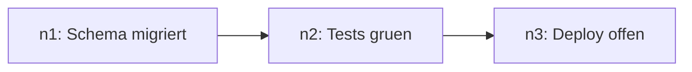

# Context-Offloading: schwere Ausgaben aus dem Kontext halten

Der Kontext ist das teuerste Gut einer Session. Große Tool-Ausgaben (Build-Logs,
Test-Dumps, Grep-Ergebnisse, Fehlertexte) gehören nicht dauerhaft hinein —
sie werden einmal gelesen, das Wesentliche extrahiert, der Rest liegt als
Datei griffbereit.

## Grundmuster

1. **Auslagern:** Erwartbar große Ausgaben direkt in eine Datei umleiten statt
   in den Kontext (`cmd > refs/<thema>.log 2>&1`, danach gezielt `Grep`/`Read`
   mit Offset statt Vollansicht). Verzeichnis: `refs/` im Projekt (bei Bedarf
   anlegen; in fremden/gitignorerten Repos: `/tmp/refs-<projekt>/`).
2. **Kurzsummary behalten:** Im Kontext bleibt nur: was war das, wo liegt es,
   was war das Ergebnis — 1–3 Sätze plus Pfad.
3. **Drill-down bei Bedarf:** Details werden bei Fehlersuche gezielt
   nachgeladen (Grep nach Fehlermuster, Read mit Zeilenoffset), nie der
   ganze Dump.

## Mermaid-Zustandskarte bei Lang-Tasks

Bei mehrstufigen Tasks (Migration, Deployment, großes Refactoring) führe eine
kompakte Zustandskarte statt Prosa-Protokoll:

- Jeder Schritt bekommt eine `node_id` (`n1`, `n2`, …); Belege/Logs liegen als
  `refs/<node_id>-*.log`. Fehlerfall: Grep nach der `node_id` liefert den
  Rohtext.
- Die Karte ersetzt das Mit-Schleppen alter Ausgaben: sie ist der Index, die
  Dateien sind die Belege.

## Grenzen

- **Kein Ersatz für Verifikation:** Beim Abschluss zählt der tatsächliche
  Befund (Tests laufen lassen, Ausgabe ansehen), nicht die Summary.
- **Klein bleiben:** Ausgaben unter ~50 Zeilen werden nicht ausgelagert —
  der Overhead lohnt nicht.
- **Secrets:** Ausgelagerte Dateien unterliegen denselben Regeln wie alles
  andere (ENF-SECRET-001): keine Keys in `refs/`-Dateien committen; `refs/`
  gehört in `.gitignore` oder nach `/tmp`.
